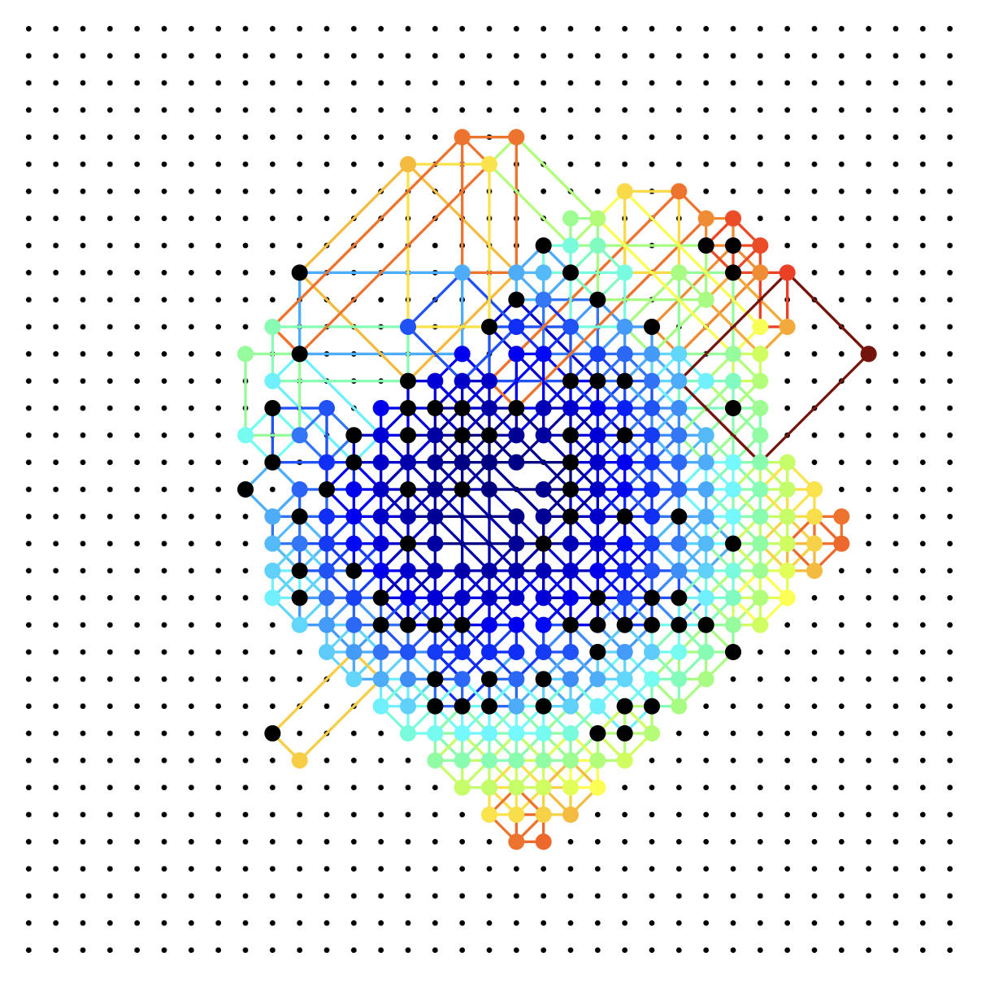

# svg\_vis

SVG composer for visualize, with Rust.

## example

visualizer for [AHC014](https://atcoder.jp/contests/ahc014/tasks/ahc014_a)

```rust
use svg_vis::chart::Chart;
use svg_vis::element::{
    Circle,
    Path,
};
use svg_vis::attribute::{
    Fill,
    Stroke,
    StrokeWidth,
};
use svg_vis::literal::color::colormap::ColorMap;
use svg_vis::literal::color::colormap::jet::Jet;

struct Input {
    n: usize,
    default_points: Vec<(i32, i32)>,
    ops: Vec<Vec<(i32, i32)>>,
}

fn input_to_svg(input: &Input) -> String {
    let mut chart = Chart::new(-1, -1, input.n as i64 + 5, input.n as i64 + 1)
        .chart_width(600);

    // jet color map
    let jet = Jet::new();

    let center = (input.n as i32 - 1) / 2;
    let weight = |x, y| {
        (x - center) * (x - center) + (y - center) * (y - center) + 1
    };
    let max_weight = input.ops.iter().map(|vs| weight(vs[0].0, vs[0].1)).max().unwrap() as f32;
    
    /* draw grid */
    for i in 0..input.n {
        for j in 0..input.n {
            let c = Circle::new().radius(0.1).fill("black");
            chart = chart.draw(c, i, j);
        }
    }
    
    /* draw connect lines */
    for vs in input.ops.iter() {
        for i in 0..4 {
            let j = (i + 1) % 4;
            let p = Path::new()
                .stroke_width(0.1)
                .stroke(jet.cmap(weight(vs[0].0, vs[0].1) as f32 / max_weight))
                .line_rel(vs[i].0 - vs[j].0, vs[i].1 - vs[j].1);
            chart = chart.draw(p, vs[j].0, vs[j].1);
        }
    }
    
    /* draw default points */
    for (i, j) in input.default_points.iter() {
        let c = Circle::new().radius(0.3).fill("black");
        chart = chart.draw(c, *i, *j);
    }
    
    /* draw points created by operations */
    for vs in input.ops.iter() {
        let (x, y) = vs[0];
        let w = weight(x, y) as f32;
        let c = Circle::new().radius(0.3).fill(jet.cmap(w / max_weight));
        chart = chart.draw(c, x, y);
    }
    
    chart.to_string()
}

fn main() {
    let input = get_input();
    println!("<html><body>{}</body></html>", input_to_svg(&input));
}
```

```
cargo run --example ahc014 < examples/ahc014_seed0_input.txt > test.html
```



## wasm

You can build web visualizer with [wasm-bindgen](https://github.com/rustwasm/wasm-bindgen).

## document

TODO...
